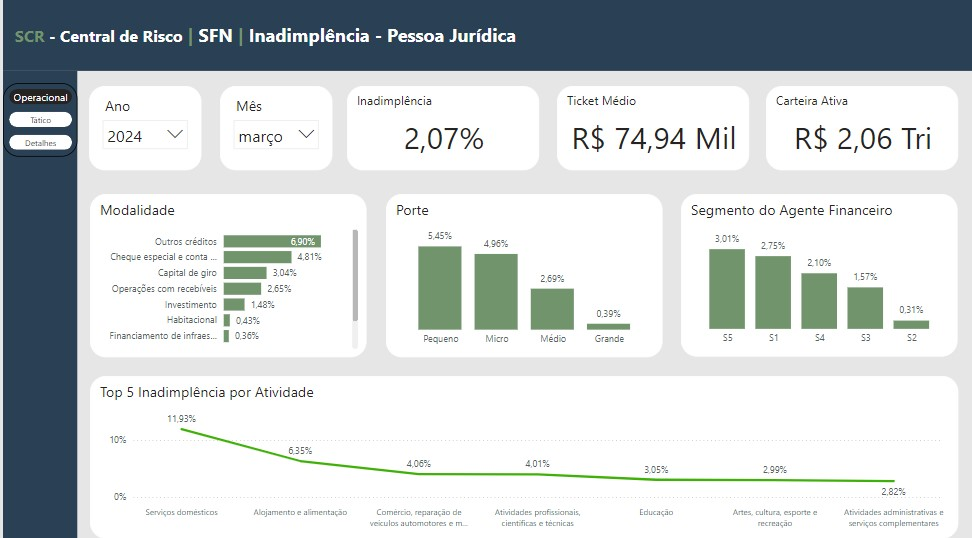
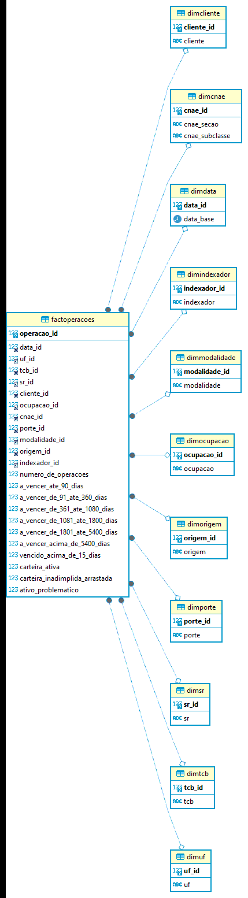

https://app.powerbi.com/view?r=eyJrIjoiMWM5YWM5OTMtZjI1MC00NWVlLWJiMmEtMjFhOTJjN2VkMWMzIiwidCI6IjNhOGNkMDAyLTMzMDktNGMyZC04ZTQ4LWQ2YTRmMDAwZWJkYSJ9

Este repositório contém o projeto de Análise de Dados com informações da base de dados abertos do Banco Central do Brasil. O painel foi desenvolvido usando PowerBi.

# Processo de ETL 
Foi desenvolvido em python, ajustando os tipos de dados e gerando as informações para criação de uma Datawarehouse. 

# Criação da DW
Utilizando linguagem sql foram criadas as dimensões e a tabela fato no banco de dados MariaDB a partir dos arquivos csv.
 

   

### Dicionário de Variáveis
#### Dimensões

 0 -  data_base:                      O dado é uma fotografia do mês e ano correspondente. As IFs informam ao BACEN 1x ao mês a situação da sua carteira de clientes.

 1 -  uf:                             Estado no qual é registrado o CEP do endereço residencial da pessoa física ou da sede da pessoa jurídica.        

 2 -  tcb:                            Tipo de Consolidação Bancária                          

 3 -  sr:                             Segmento da IF que informou a operação, podendo ir de S1 (Grandes bancos com porte equivalente a 10% do PIB ou que exerçam atividade 
                                      internacional relevante) a S5 (IFs de porte inferior 0,1% do PIB), classificação determinada pela Resolução 4.553/2017 do Banco Central do Brasil.

 4 -  cliente:                        PJ ou PF   

 5 -  ocupacao:                       O dado em caso de PJ é informada a atividade correspondente ao CNAE principal e em caso de PF a ocupação informada no cadastro junto a IF.

 6 -  porte:                          Em caso de PF classificação conforme a renda em relação ao Salário Mínimo. PJ Informação quanto ao porte utilizada pelo SEBRAE:  MICRO, PEQUENO, 
                                      MÉDIO, GRANDE.

 9 -  modalidade:                     Relativo à destinação do empréstimo em caso de pessoa Jurídica (Capital de Giro, Investimento, Obras) e a forma de contratação em caso de pessoa 
                                      física (Consignação em folha )                       

 11 - indexador:                      Determina como serão aplicadas as taxas de juros (pré-fixadas, pós-fixadas, índices de preços...)

 #### Fato

 12 - numero_de_operacoes:            A quantidade de operações que se enquadra nessas características para esse cliente.         
 
 13 - a_vencer_ate_90_dias:           Somatória dos valores a vencer com prazo até 90 dias (3 meses)       
 
 14 - a_vencer_de_91_ate_360_dias:    Somatória dos valores a vencer com prazo entre 91 e 360 dias (3 meses a 1 ano)
 
 15 - a_vencer_de_361_ate_1080_dias:  Somatória dos valores a vencer com prazo entre 361 até 1080 dias (entre 1 e 3 anos)
 
 16 - a_vencer_de_1081_ate_1800_dias: Somatória dos valores a vencer com prazo entre 1081 até 1800 dias (entre 3 e 5 anos )
 
 17 - a_vencer_de_1801_ate_5400_dias: Somatória dos valores a vencer com prazo entre 1801 até 5400 dias (entre 5 e 15 anos )
 
 18 - a_vencer_acima_de_5400_dias:    Somatória dos valores a vencer com prazo acima de 5400 dias (acima de 15 anos)
 
 19 - vencido_acima_de_15_dias:       Somatória dos valores vencidos há mais de 15 dias       
 
 20 - carteira_ativa:                 Somatória de toda a carteira, ou seja todas as operações que se enquadram nessas caracteríscticas com valores vencidos e a vencer.        
 
 21 - carteira_inadimplida_arrastada: Somatório das operações de crédito a vencer e vencidos que possuam alguma parcela vencida há mais de 90 dias.

 22 - ativo_problematico              Somatório dos créditos das operações de crédito classificadas com risco entre E (a partir de 91 dias de atraso) e H (maior que 180 dias de atraso),
                                      operações reestruturadas e das operações consideradas na carteira inadimplida arrastada (ver conceitos no item 2.d em scr_data_metodologia.pdf)    

 23 - Inadimplencia:                  Calcula-se pela divisão do valor da carteira das operações de crédito com alguma parcela em atraso acima de 90 dias (Carteira inadimplida arrastada) 
                                      pelo valor da carteira de todas 
                                      as operações.

Metodologia disponível no Portal de Dados Abertos do Bacen:
https://www.bcb.gov.br/content/estabilidadefinanceira/scr/scr.data/scr_data_metodologia.pdf

